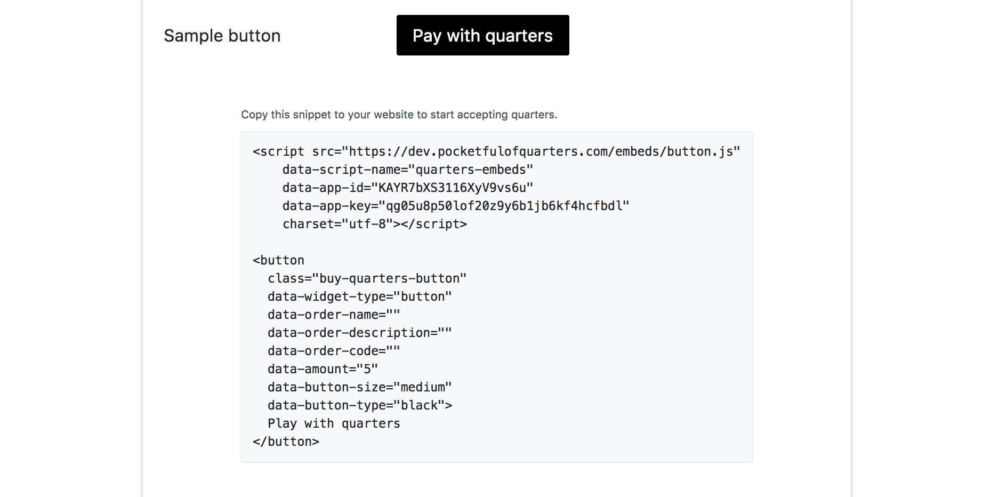

# Quarters Buttons

### Integrate Quarters on your website in an embedded window

**Sample Button**

<div></div>

<button
  class="buy-quarters-button"
  data-widget-type="button"
  data-order-name="Sample docs"
  data-order-description="Sample quarters transfer"
  data-order-code="1"
  data-amount="5"
  data-button-size="medium"
  data-button-type="black">
  Play with quarters
</button>

<script src="https://pocketfulofquarters.com/embeds/button.js"
    data-script-name="quarters-embeds"
    data-app-id="KAYR7bXS3116XyV9vs6u"
    data-app-key="qg05u8p50lof20z9y6b1jb6kf4hcfbdl"
    charset="utf-8"></script>

**Sample code**

When you create an quarters button, it will give you code like this example.

```html
<button
  class="buy-quarters-button"
  data-widget-type="button"
  data-order-name="Sample docs"
  data-order-description="Sample quarters transfer"
  data-order-code="1"
  data-amount="5"
  data-button-size="medium"
  data-button-type="black">
  Play with quarters
</button>

<script src="https://pocketfulofquarters.com/embeds/button.js"
    data-script-name="quarters-embeds"
    data-app-id="KAYR7bXS3116XyV9vs6u"
    data-app-key="qg05u8p50lof20z9y6b1jb6kf4hcfbdl"
    charset="utf-8"></script>
```

### How to create Quarters Button

Quarters buttons can be generated via our button generator (shown below) once you create [your first app](guides/create-app.md)

The button generator is the easiest way to get started.


This will create code like this.



The only required parameter is `amount`. The rest can be set when you create the button or later via the `data-*` attributes in the embed HTML. `data-*` attributes will override any attributes you set in the button generator.

Once a button is generated, you'll be given a few lines of HTML code to copy and paste into your website. This will add the button to your page.

Buttons can be thought of as disposable (they are just a way to hard code a name and price into a code attribute) so if you mess up you can always start over with a new button.

### Integration Details

A separate `requestId` is generated for each order and user. If a user is already signed in to a Quarters account, they can complete the checkout in two clicks - this is the fastest method of transfer.

Once a transfers completes, a `onQuartersCallback` window function will be fired along with a code param referencing the same button.

```js
// Get quarters button callback
wndow.onQuartersCallback = function(data) {
  if (data.error) {
    // data.message
  } else if (data.cancel) {
    // user canceled transfer
  } else {
    // data.txId => Ethereum transaction tx id
    // data.requestId => Request Id to get details about order (/v1/requests/:requestId)
    // data.order_code => reference to button `data-order-code`
  }
}
```

On successful transfer, following param will be generated:

Parameter | Description
--- | ---
`txId` | Ethereum transaction hash which you can use to validate confirmed transaction on blockchain
`requestId` | Order id which you can use to retrieve order details. <br>Order details can be fetched using `client_secret` (server key) using [Node SDK](sdk/node.md) <br>API: `/v1/requests/:requestId`
`order_code` | Order code. Same as code supplied using `data-order-code`. <br>Used when multiple buttons are there on a page to identify order.

### Advanced Options

#### Customizing the Embed HTML

The embed html consists of one script tag referencing `https://pocketfulofquarters.com/embeds/button.js` and an element with class `buy-quarters-button` with `data-widget-type='button'`.

You can have one or more elements with class `buy-quarters-button` on the page (if you’re including multiple buttons), but only one script tag is ever needed.

After adding the `buy-quarters-button` class, the only required parameters are `data-amount` and `data-widget-type`. The other params can be updated after the button is created by setting `data-*` attributes on the element. This makes it easy to update fields without having to create a new button.

The div can have the following params:

Field | Description
--- | ---
`data-amount` | **Required** Integer amount of quarters for order.
`data-button-size` | **Optional** one of `medium`, `large` or `small`. <br>These different button styles can be previewed in the button generator. <br>Default is `medium`.
`data-button-type` | **Optional** one of `black`, `green`, `red` or `grey`. <br>These different button types can be previewed in the button generator. <br>Default is `black`.
`data-order-name` | **Optional** Order name which will be shown to user.
`data-order-code` | **Optional** Unique code per page. <br>It will be used to identify multiple orders on same page.
